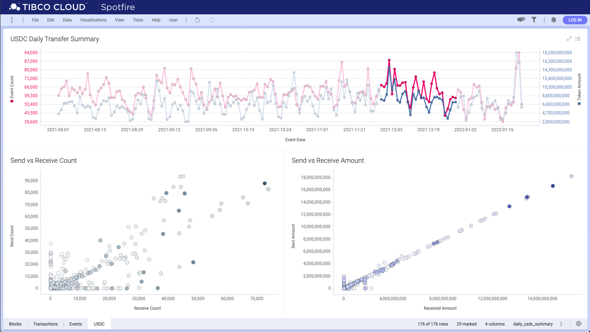

# Decode and Visualize Ethereum Data

Decode Ethereum transactions and events, and store the result in a [ClickHouse](https://clickhouse.com/docs/en/) database for data analysis.

## Setup database schema

Use [setup.sh](./store/setup.sh) to define tables and views for Ethereum data.

## Decode Ethereum data and Store results in ClickHouse

Define environment variables, e.g.,

```sh
export ETHEREUM_URL=/data/ethereum/geth.ipc
export ETHERSCAN_APIKEY=<my-etherscan api key>
export CLICKHOUSE_URL=http://localhost:8123
export CLICKHOUSE_DB=ethdb
export CLICKHOUSE_USER=default
export CLICKHOUSE_PASSWORD=
export GLOG_logtostderr=false
```

Start decoder process:

```sh
nohup ./cmd -log_dir /data/log/default -command default 2>&1 > /data/log/nohup.out &
nohup ./cmd -log_dir /data/log/rejectTx -command rejectTx 2>&1 > /data/log/nohup2.out &
```

## Sample ClickHouse Query

ERC20 token transfer transactions with known symbols

```sql
SELECT 
    Hash, From, To, 
    arrayElement(Params.ValueString, 1) as Recipient, 
    divide(arrayElement(Params.ValueDouble, 2), exp10(Decimals)) as Amount, 
    BlockTime, Symbol, Decimals 
FROM ethdb.transactions t 
INNER JOIN ethdb.contracts c 
ON t.Method = 'transfer' AND c.Symbol != '' AND t.To = c.Address
```

Top daily transfers of ERC20 tokens

```sql
SELECT 
    count() as Count, 
    divide(sum(arrayElement(Params.ValueDouble, 2), exp10(Decimals))) as Amount, 
    Symbol, toDate(BlockTime) as Date 
FROM ethdb.transactions t 
INNER JOIN ethdb.contracts c 
ON t.Method = 'transfer' AND c.Symbol != '' AND t.To = c.Address 
GROUP BY Symbol, Date 
ORDER BY Count DESC
```

## Visualize data in Spotfire

[Spotfire Analyst](https://docs.tibco.com/pub/spotfire/general/sr/GUID-866E8AA7-37D5-417B-B3B0-CDD7125D46B8.html?_ga=2.151564863.701630237.1643400214-2057914078.1626913033) may connect to a ClickHouse database directly via an [ODBC driver](https://github.com/ClickHouse/clickhouse-odbc/releases), or via a TIBCO Cloud Spotfire server that connects to a ClickHouse data source configured in a [TIBCO Data Virtualization](https://www.tibco.com/products/data-virtualization) server by using either the [Native JDBC Driver](https://github.com/housepower/ClickHouse-Native-JDBC/releases/tag/v2.6.4) or the [Official JDBC Driver](https://github.com/ClickHouse/clickhouse-jdbc/releases/tag/v0.2.6).

A sample Ethereum dashboard implemented in [Spotfire Analyst](https://docs.tibco.com/pub/spotfire/general/sr/GUID-866E8AA7-37D5-417B-B3B0-CDD7125D46B8.html?_ga=2.151564863.701630237.1643400214-2057914078.1626913033) is described in [this blog](https://community.tibco.com/wiki/visualizing-ethereum-data-using-tibco-spotfire).



## Visualize data in Redash

Start a [Redash](https://redash.io/product/) server instance as described [here](https://redash.io/help/open-source/setup).

Follow [Getting Started](https://redash.io/help/user-guide/getting-started) to login and create query and dashboard in a web browser.

## Visualize data in JupyterLab

If you are a data analyst with Python knowledge, you can analyze and visualize Ethereum data in JupyterLab.

Install Python 3, e.g., using [pyenv](https://github.com/pyenv/pyenv) on MacOS:

```sh
brew install pyenv
pyenv install -l
pyenv install 3.10.1
echo -e 'if command -v pyenv 1>/dev/null 2>&1; then\n  eval "$(pyenv init --path)"\nfi' >> ~/.zshrc
. ~/.zshrc
```

Install JupyterLab according to the [instruction](https://jupyterlab.readthedocs.io/en/stable/getting_started/installation.html), e.g.,

```sh
pip install jupyterlab
```

Install other dependencies, e.g.,

```sh
pip install clickhouse-driver
pip install plotly
pip install pandas
pip install kaleido

jupyter labextension install @jupyter-widgets/jupyterlab-manager @jupyterlab/geojson-extension
jupyter labextension install jupyterlab-plotly
```

Start JupyterLab:

```sh
jupyter lab
```

Open the sample notebook [plotly-charts.ipynb](./plotly-charts.ipynb), which describes steps to query the ClickHouse database and visualize results in [plotly](https://plotly.com/python/getting-started/#overview) charts.

## Todo

* Collect ERC token balance of every EOA (Externally-Owned Account), e.g., by calling `balanceOf(eoa)` on the contract in each ERC-20/ERC-721 transfer transaction, or `balanceOfBatch()` for ERC-1155 batch-transfer transactions.
* Collect ETH balance of every EOA by looking at state trie change after every block?